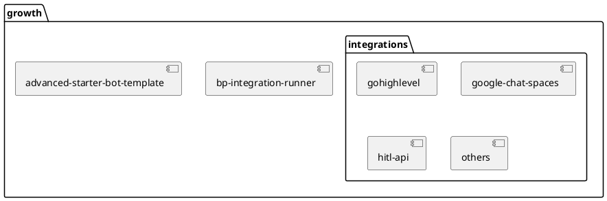
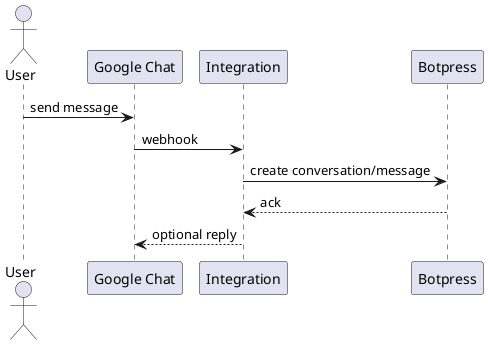

# Botpress Growth

Botpress Growth is a collection of official integrations and tooling that help developers extend the Botpress platform. This monorepo contains reusable packages, a set of ready-made integrations and an advanced bot template that demonstrates common patterns.

## Repository Structure

- **`bp-integration-runner`** – Utility to run and expose a Botpress integration locally using ngrok.
- **`integrations/`** – Individual integration packages (e.g. GoHighLevel, Google Chat, Salesforce, HubSpot HITL, TwilioVoice, SharePoint, etc.).
- **`advanced-starter-bot-template`** – Example bot project showcasing advanced techniques.

## Architecture

### Runtime Interaction (example: Google Chat)

## Process Breakdown

### bp-integration-runner
Runs a local integration with live reload and updates its URL in Botpress. Environment variables are loaded from `.env` and checked for required keys `BOTPRESS_PAT` and `BOTPRESS_WORKSPACE_ID` as shown in the script.
Entry point: [`bp-integration-runner/run.js`](bp-integration-runner/run.js).

### Integrations
Each folder under `integrations/` is a standalone package. The entry file is `src/index.ts` and configuration schema is defined in `integration.definition.ts`. For example, the Google Chat integration expects a service account JSON and a default space ID in its configuration【F:integrations/google-chat-spaces/integration.definition.ts†L1-L18】.

### Advanced Starter Bot Template
A ready‑to‑use bot showcasing techniques such as event tracking, loading user data and live agent handoff. See the topics covered in its README【F:advanced-starter-bot-template/README.md†L1-L17】.

## Setup & Local Development

1. **Prerequisites** – Node.js 18+, [pnpm](https://pnpm.io) 8.
2. Install dependencies: `pnpm install`.
3. Optional: create `.env` at the project root with credentials for the runner or integrations.
4. Run tests: `pnpm test` (uses Vitest)【F:package.json†L4-L9】.
5. Lint & type-check: `pnpm check`【F:package.json†L21-L22】.

## Deployment

Each integration can be deployed with the Botpress CLI (`bp deploy`) or via `pnpm run deploy` in the integration folder. A GitHub Action verifies that the integration version is bumped before merging new changes.

## Contributing

- Format and lint code using `pnpm fix` or run `pnpm check` before committing.
- Keep commit messages concise and in the imperative mood.
- New integrations should place code under `integrations/<name>` and include a `package.json` with a unique `integrationName` field.

## License

TODO

## Acknowledgements

TODO
